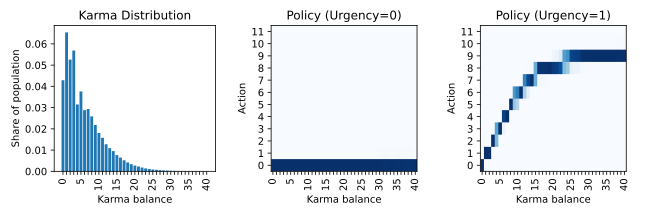
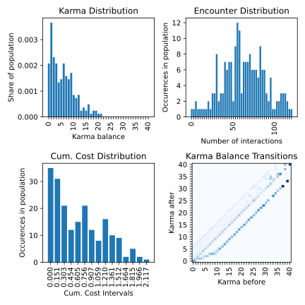
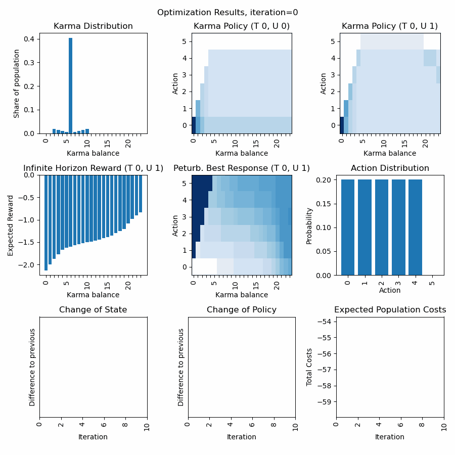

Getting Started
##############################################

In this tutorial we will discuss how to get started with the library.
First we define a Karma Game, then we compute the social state at the stationary Nash equilibrium (optimal rational policy + stationary state distribution) using the Optimizer. 
Next, we use the Karma Game and the computed social state to apply the Karma Game in simulations using the Simulator.
Finally, we will visualize the different process steps.
In addition to that, we will see how to load and save a model.

More advanced topics can be found in the examples section.
There, we will discuss how to fine tune hyper parameters in order to achieve stability and convergence during optimization.
In addition to that, we will discuss advanced topics of modelling Karma games.

Define a Karma Game
----------------------------------------------

In this example we will define a simple Karma Game instance that we will use in the next example to compute the optimal policy for a selfish agent.
We will reproduce the Karma Game from the publication `"Today me, tomorrow thee: Efficient resource allocation in competitive settings using karma games." <https://ieeexplore.ieee.org/abstract/document/8916911>`_.

First we need to define the GameParameters for a Karma Game with two participants per interaction, 200 agents, 
and an initial average karma balance of 6 across the population.
We make use of several template functions, in order to model a Game, where the interaction is a sealed bid auction
between two agents, in which the highest bid wins, the bid is paid to the peer, and thus no Karma overflow is distributed,
and no Karma is redistributed.
More advanced applications might require the design of your own functions, we will discuss that in another example below.

.. code-block:: python

	import numpy as np
	import karma_game_library as karma

	# Define Karma Game
	num_agents = 200
	num_types = 1
	num_urgencies = 2
	num_outcomes = 2
	num_average_karma = 6

	lst_init_types = np.random.randint(num_types, size=num_agents)
	lst_init_urgencies = np.random.randint(num_urgencies, size=num_agents)
	lst_init_karmas = num_average_karma*np.ones(num_agents)

	parameters = karma.GameParameters(num_agents=num_agents,
					  num_participants=2,
					  num_types=num_types,
					  num_urgencies=num_urgencies,
					  num_outcomes=num_outcomes,
					  num_average_karma=num_average_karma,
					  map_type_temp_preference={0: 0.8},
					  lst_init_types=lst_init_types,
					  lst_init_urgencies=lst_init_urgencies,
					  lst_init_karmas=lst_init_karmas,
					  func_cost=karma.templates.cost.default,
					  func_outcome=karma.templates.outcome.highest_bid,
					  func_payment=karma.templates.payment.highest_bid_to_peer,
					  func_urgency_transition=karma.templates.urgency_transition.random,
					  func_overflow_distribution=karma.templates.overflow_distribution.none,
					  func_karma_redistribution=karma.templates.karma_redistribution.none)

Compute stationary Nash equilibrium using Optimizer
----------------------------------------------------

Now that we have defined the GameParameters, let us proceed and define the social state (a Policy and a StateDistribution), that we aim to optimize.
The initialization parameter describes how we want to initialize the policy. 
The policy represents the probability distribution across actions for a given temporal preference type, urgency level, and karma balance.
There are three options for the initialization parameter that determines the initial probability distribution of the policy: "even", "bottom", and "top".
We usually recommend to use "even", as convergence is more computationally stable.
The state is initialized accoridng to the initial population defined in the GameParameters (lst_init_types, lst_init_urgencies, lst_init_karmas).

.. code-block:: python

	# Define entities for optimization
	policy = karma.Policy(game_parameters=parameters, initialization="even")
	state = karma.StateDistribution(game_parameters=parameters)

After instantiating policy and state distribution, let us proceed and instantiate an instance for the Optimizer.
There are certain hyper parameters in addition to the GameParameters that need to be defined.
`hyper_dt` represents the step width with which new state distributions changes in an optimization interation.
`hyper_nu` represents the step width with which, relative to the step width of the state distribution, the policy changes in an optimization interation.
`hyper_lambda` represents how strongly the optimization goes in the direction of the gradient descent.
The optimization algorithm is an extension of the algorithm described in the publication `"A self-contained karma economy for the dynamic allocation of common resources" <https://link.springer.com/article/10.1007/s13235-023-00503-0>`_.

.. code-block:: python
	
	# Compute stationary Nash equilibrium
	optimizer = karma.Optimizer(game_parameters=parameters,
				    hyper_lambda=1000,
				    hyper_dt=0.10,
				    hyper_nu=0.80,
				    func_prob_outcome=karma.templates.p_outcome.highest_bid,
				    func_prob_karma_transition=karma.templates.p_karma_transition.highest_bid_to_peer_no_redistribution,
				    func_prob_urgency_transition=karma.templates.p_urgency_transition.random)

Another important aspect to mention is, that we need three probabilistic functions for the optimization, that must be tailored to the specific logic functions defined in GameParameters.
The correct modelling of these probabilistic functions is crucial for the Optimizer to find reasonable and accuracte solutions for the specific Karma Game resource allocation problem.
In our template library, we offer various different probabilistic functions, however, in more advanced cases you might 
need to model these functions yourself. Several checks will support you to avoid misspecifications of the GameParamters and probabilistic functions.
As mentioned before, we will discuss some best practices on the peculiarities of modelling in the examples section.

During the optimization, the policy and state capture a finite karma balance space and thus possible action space.
The action space is limited the by the largest amount of karmas in the population, and is dynamically extended when higher karma balances in the population occur.
The karma balance space is also dynamically extended in case the karma balance distribution reaches the boundary of the current karma balance space.

Now that he have defined our Optimizer instance, we can start the optimization process as a loop of iterations.
Every call of `optimizer.compute_iteration()` will change state and policy, and return four parameters that represent how much and in which direction (cosine similarity) the change of state and policy matrixes took place.
We suggest to define a maximum number of iterations and thresholds for early convergence to define boundaries for the runtime.
Moreover, as the optimization can time consuming, to print an update on the optimization process to the console (e.g. every ten times).
More advanced rules and also the dynamic change of the hyper parameters after each iteration are possible to accelerate the convergence, and will be discussed in the examples section.

.. code-block:: python

	max_iterations = 1000
	threshold_state = 0.002
	threshold_policy = 0.001
	for iteration in range(0, max_iterations):
	    delta_state, delta_policy, direct_state, direct_policy = optimizer.compute_iteration(state, policy)
	    if iteration%10 == 0:
	        print("Current iteration %d, delta_state=%.4f, delta_policy=%.4f" % (iteration, delta_state, delta_policy))
	    if delta_state <= threshold_state and delta_policy <= threshold_policy:
	        break

At any point during the iteration, it is possible to retrieve intermediate computation results, such as the distribution of agent actions `v`, the probability of interaction outcomes given an action `gamma`, 
the probabilistic karma transition function `kappa`, the immediate reward function `xi, the probabilistic state transition function `rho`, the expected immediate reward `Rt`, the state transition probabilities `Pt`,
the expected infinite horizon reward `Vt`, the single-stage deviation reward `Qt`, and the perturbated best response policy `pit`.

Congratulations, you have successfully computed an approximation of the stationary Nash equilibrium, consisting of the optimal rational policy for selfish agents and a stationary state distribution.
Let us have a look on the calculated policy and karma distribution, by visualizing the Nash equilibrium (after thousand iterations of optimization):

.. code-block:: python

	# Visualize Optimization Results: Policy and StateDistribution
	import matplotlib.pyplot as plt
	xlabels = []
	counter = 0
	for s in parameters._set_state_karmas:
	    if counter%5==0:
	        xlabels.append(str(s))
	    else:
	        xlabels.append("")
	    counter += 1
	plt.figure("Social State in the Stationary Nash Equilibrium", figsize=(3*3,3))
	plt.title("Social State in the Stationary Nash Equilibrium")
	plt.subplot(1,3,1)
	plt.title("Karma Distribution")
	karma.visualizer.draw_karma_distribution_from_state(state=state, game_parameters=parameters)    
	plt.gca().set_xticklabels(xlabels)
	plt.subplot(1,3,2)
	plt.title("Policy (Urgency=0)")
	karma.visualizer.draw_specific_policy(policy=policy, game_parameters=parameters, atype=0, urgency=0)
	plt.gca().set_xticklabels(xlabels)
	plt.subplot(1,3,3)
	plt.title("Policy (Urgency=1)")
	karma.visualizer.draw_specific_policy(policy=policy, game_parameters=parameters, atype=0, urgency=1)
	plt.gca().set_xticklabels(xlabels)
	plt.tight_layout()

The "Karma Distribution" shows the average karma distribution across all urgencies for agent type=0.
The two policies represent a plausible behaviour for agents that discount future rewards (costs) (we set a discount rate of 0.8). 
If there is no urgency (urgency=0), then there are no costs, and therefore no Karma units are bidded.
If there is urgency, then a certain amaount of the available karma balance is bid, but not all, to save some for future interactions.

What we can see from the diagrams is that after optimization, the Karma balance space expanded to 27 and the action space to 10.
This means, that we can compute this optimal policy and stationary distribution for an infinite space sufficiently by the finite space,
as there are (statistically) no individual with karma balances larger than 27 and they will not make bids larger than 10.

Save & Load the Karma Game
----------------------------------------------

Before we continue, it could make sense to store our results, so that we do not need to recompute them the next time.
In order to save the situation of the Karma Game (for example after policy computation with the Optimizer), 
three objects need to be saved, the StateDistribution (state), the Policy (policy) and the GameParameters (parameters).
They are stored as TXT files in a Pickle format.

.. code-block:: python
	
	# Save Karma Game 
	state.save("state.txt")
	policy.save("policy.txt")
	karma.GameParameters.save(parameters, "parameters.txt")

Of course, we also need to show how loading the model can be done after saving.
In order to load and restore a previous situation of the Karma Game, the three previously objects can be loaded from the TXT files.

.. code-block:: python
	
	import karma_game_library as karma

	# Load Karma Game
	parameters = karma.GameParameters.load("parameters.txt")
	state = karma.StateDistribution(game_parameters=parameters)
	state.load("state.txt.npy")
	policy = karma.Policy(game_parameters=parameters, initialization="even")
	policy.load("policy.txt.npy")
	

Perform a simulation
----------------------------------------------

Before we start the simulation, we need to define a Simulator.

.. code-block:: python

	# Define Simulator
	simulator = karma.Simulator(game_parameters=parameters)

This will create an internal representation of the population as a matrix that captures the type, urgency level, karma balance, cumulative costs and number of encounters each agent has over time.
At any point in time, it is possible to access the information of agents via functions such as `get_agent_information()`, `get_population_cumulative_costs()`, `get_population_encounters()` and `get_agent_population()`.
Moreover, one can access information at the population level, including the Karma distribution across the population using `get_karma_distribution()`, the state (urgency-karma) transition distribution `get_state_transition_distribution()`, 
the total cumulative costs across the population `get_total_cumulative_costs()` and the total number of encounters `get_total_encounters()` that happened.

Now that we have a defined KarmaGame and a stationary Nash equilibrium (optimal policy + stationary distribution) let us use this to simulate the KarmaGame.

.. code-block:: python
	
	# Compute Simulation
	num_iterations = 10000
	for i in range(0, num_iterations):
	    simulator.begin_epoch()
		
	    # option 1: peer_selection_random()
	    participants = simulator.peer_selection_random()
	    simulator.play_interaction(policy,participants)
	    # option 2: peer_selection_whole_population()
	    participants = simulator.peer_selection_whole_population()
	    simulator.play_interaction(policy,participants)
	    # option 3: peer_selection_random_non_exclusive_peer_groups()
	    participants_groups = simulator.peer_selection_random_non_exclusive_peer_groups(n_groups=5)
	    for participants in participants_groups:
	        simulator.play_interaction(policy,participants)
	    # option 4: peer_selection_random_exclusive_peer_groups()
	    participants_groups = simulator.peer_selection_random_exclusive_peer_groups(n_groups=5)
	    for participants in participants_groups:
	        simulator.play_interaction(policy,participants)
			
	    epoch_counter = simulator.close_epoch()
	    print(epoch_counter)
		
The simulation takes place in three steps per epoch.
The **first step** is to open the next epoch. In this step, certain states are recorded internally.
The **second step** can consist of one or multiple interactions.
Each interaction requires a list of participating agent indexes, will determine the actions of the participants randomly based on the probabilities of the policy, and compute an outcome of the interaction based on the participant actions.
The outcome of the interaction will then cause the transaction which includes the update of costs and karma balances.
The selection of participating agents can take place by inputing a list.
This inputing of the list could originate from a domain specific simulator.
The selection of participating agents can alternatively take place randomly by functions provided by the Simulator class. 
There are four possible functions for that (see options in the code).
The **third step** is to close the epoch. This includes the urgency transition, karma overflow distribution and karma redistribution. Besides, this includes internal reecording of states again.

As shown above, the integration of domain specific simulators is simple, as multiple interactions per epoch are possible, and epochs can be aligned & synchronized with dedicated periods from the domain specific simulator.
The simulator can also be reset to the initial state using `reset()`, if multiple repetitions of an experiment shall be conducted.

Let us have a look on the population situation after 10000 simulated epochs for option 1 (see above):

.. code-block:: python

	# Visualize Karma Game after 10000 iterations
	xlabels = []
	counter = 0
	for s in parameters._set_state_karmas:
	    if counter%5==0:
	        xlabels.append(str(s))
	    else:
	        xlabels.append("")
	    counter += 1
	import matplotlib.pyplot as plt
	plt.figure("Karma Game Simulation", figsize=(3*2,3*2))
	plt.rc('font', family='sans-serif') 
	plt.rc('font', serif='Arial') 
	plt.title("Karma Game Simulation")
	plt.subplot(2,2,1)
	plt.title("Karma Distribution")
	karma.visualizer.draw_karma_distribution_from_simulator(simulator, parameters)
	plt.gca().set_xticklabels(xlabels)
	plt.subplot(2,2,2)
	plt.title("Encounter Distribution")
	karma.visualizer.draw_distribution_from_simulator(simulator, parameters, simulator._ENCOUNTERS_COL, 'unique')
	plt.xlabel("Number of interactions")
	plt.subplot(2,2,3)
	plt.title("Cum. Cost Distribution")
	karma.visualizer.draw_distribution_from_simulator(simulator, parameters, simulator._CUM_COST_COL, 'histogram')
	plt.xlabel("Cum. Cost Intervals")
	plt.tight_layout()
	plt.subplot(2,2,4)
	plt.title("Karma Balance Transitions")
	x = karma.visualizer.draw_karma_transition_heatmap_from_simulator(simulator, parameters)
	plt.gca().set_xticklabels(xlabels)
	plt.gca().set_yticklabels(xlabels)
	plt.tight_layout()

The shape of the Karma distribution is similar to the predicted stationary Nash equilibrium. 
On average, each agent had around 50 interactions on average. 
Furthermore, we can see that the cumulative costs of the agents are skewed to the right, with an average of 0.7. 
The karma balance transition shows the probabilities that an agent with a karma balance before (x axis) ends up with a karma balance after (y axis), averaged across all types and urgencies.

Visualization of the optimization progress
----------------------------------------------
As the optimization progress is time consuming, it can be helpful to display the intermediate results of optimization in order to fine-tune hyper parameters etc.
We usually create a set of images to have a visual animation of the optimization to develop a better understanding.
It is possible to render animations (GIF graphics) with our software framework to visualize the optimization process into more detail over the iterations.
For further functionalities please review the API reference (documentation) of all functionalities that our `karma_game_library.visualizer` module offers.

In the following we display an example of the animation of the above discussed resource allocation problem and render a GIF animation from it.
First we define a function to display selected aspects of the optimization results.

.. code-block:: python

	import matplotlib.pyplot as plt

	def draw_optimization_progress(optimizer, parameters, state, policy, iteration, save=False, close=False, last_n=200, folder="figs"):
	    xlabels = []
        counter = 0
        for s in parameters._set_state_karmas:
            if counter%5==0:
                xlabels.append(str(s))
            else:
                xlabels.append("")
	        counter += 1
	    fig = plt.figure("Optimization Results", figsize=(9,9))
	    fig.set_tight_layout(True)
	    plt.suptitle("Optimization Results, iteration="+str(iteration))
	    plt.subplot(3,3,1)
	    plt.title("Karma Distribution")
	    karma.visualizer.draw_karma_distribution_from_state(state=state, game_parameters=parameters)
	    plt.gca().set_xticklabels(xlabels)
	    plt.subplot(3,3,2)
	    plt.title("Karma Policy (T 0, U 0)") 
	    karma.visualizer.draw_specific_policy(policy, parameters, atype=0, urgency=0)
	    plt.gca().set_xticklabels(xlabels)
	    plt.subplot(3,3,3)
	    plt.title("Karma Policy (T 0, U 1)") 
	    karma.visualizer.draw_specific_policy(policy, parameters, atype=0, urgency=1)
	    plt.gca().set_xticklabels(xlabels)
	    plt.subplot(3,3,4)
	    plt.title("Infinite Horizon Reward (T 0, U 1)") 
	    karma.visualizer.draw_distribution_bar(parameters._set_state_karmas, optimizer.V[0][1])
	    plt.xlabel("Karma balance")
	    plt.ylabel("Expected Reward")
	    plt.gca().set_xticklabels(xlabels)
	    plt.subplot(3,3,5)
	    plt.title("Peturb. Best Response (T 0, U 1)") 
	    labels_x = karma.visualizer._convert_set_to_labels(parameters._set_state_karmas)
	    labels_y = karma.visualizer._convert_set_to_labels(parameters._set_actions)
	    karma.visualizer.draw_heatmap(optimizer.Q[0][1].transpose(), labels_x, labels_y)
	    plt.xlabel("Karma balance")
	    plt.ylabel("Action")
	    plt.gca().set_xticklabels(xlabels)
	    plt.subplot(3,3,6)
	    plt.title("Action Distribution") 
	    karma.visualizer.draw_distribution_bar(parameters._set_actions, optimizer.v)
	    plt.xlabel("Action")
	    plt.ylabel("Probability")
	    plt.subplot(3,3,7)
	    plt.title("Change of State")
	    plt.plot(np.arange(max(0, iteration-last_n), iteration+1), np.asarray(optimizer.recorder)[-last_n-1:,0])
	    plt.xlabel("Iteration")
	    plt.ylabel("Difference to previous")
	    plt.gca().get_yaxis().set_ticks([])
	    if iteration==0:
	        plt.xlim([0, 10])
	    plt.xticks(rotation = 90)
	    plt.subplot(3,3,8)
	    plt.title("Change of Policy")
	    plt.plot(np.arange(max(0, iteration-last_n), iteration+1), np.asarray(optimizer.recorder)[-last_n-1:,1])
	    plt.xlabel("Iteration")
	    plt.ylabel("Difference to previous")
	    plt.gca().get_yaxis().set_ticks([])
	    if iteration==0:
	        plt.xlim([0, 10])
	    plt.xticks(rotation = 90)
	    plt.subplot(3,3,9)
	    plt.title("Expected Population Costs")
	    plt.plot(np.arange(max(0, iteration-last_n), iteration+1), np.asarray(optimizer.recorder)[-last_n-1:,2])
	    plt.xlabel("Iteration")
	    plt.ylabel("Total Costs")
	    if iteration==0:
	        plt.xlim([0, 10])
	    plt.xticks(rotation = 90)
	    # finish up
	    plt.tight_layout()
	    if(save):
	        plt.savefig(fname=folder+"/Iteration-"+str(iteration)+".png")
	    if(close):
	        plt.close()
	    return fig
		
Now, all you need to do is to create a folder "figs/", and to replace the optimization iteration loop from above with following loop:

.. code-block:: python

	import matplotlib.pyplot as plt
	
	plt.ioff()
	images = []
	for it in range(0,1000):
	    print(it,"\t",optimizer.compute_iteration(state, policy))    
	    if it%10==0:
	        draw_optimization_progress(optimizer, parameters, state, policy, it, save=True, close=True, last_n=400, folder="figs")
	        images.append("figs/Iteration-"+str(it)+".png")
			
Last but not least after computing the series of images we can render a GIF animation from it.

.. code-block:: python
			
	karma.visualizer.render_gif_animation(images, "animation.gif")

Et voila, we have an animated visualization of the optimization progress for the first 1000 iterations.

**Discussion of first row:** What we can observe is that the policy for urgency level=0 quickly converges to a bid of zero, and the policy for urgency level=1 is a curve below the diagonal (so dont bid all to economize Karma for next interactions).
The Karma distribution starts with a peak at 6 (the average Karma in the population) and converges towards a stationary distribution.

**Discussion of second row:** We can observe how the inifinte horizon reward converges to a curve, where possessing higher karma balances usually is expected to have fewer costs (negative rewards) as through bidding one can avoid unpleasent situations.
The action distirbution starts with an initial distribution (see policy) but then converges to a stationary distribution in line with the Karma distribution and policies.
The perturbated best response displays the expected reward for a given Karma balance and action and guides the policy optimization. The policy becomes a line of highest descent in the perturbated best response topology.

**Discussion of third row:** We can observe how strong state and policy change over the iterations (usually after an initial phase they steadily decrease). 
Besides, we can observe the expected total population costs (product of Karma distribution and initite horizon reward. (usually we can observe a steady decrease).

**Dynamic extension of state and action space:** We can observe that once the karma distribution reaches a certain threshold value at its boundaries (on the left), the state space is expanded. 
We can observe, that once the policy reaches a certain threshold value at its boundaries (on the top), the action space is expanded.
As long the state distribution  and action distribution stay in their finite boundaries, the infinite state action space of a Karma game can be represented (and computed) by this finite state action space numerically.
Every time new actions or states are introduced, peaks in the curves of the last row become visible.

